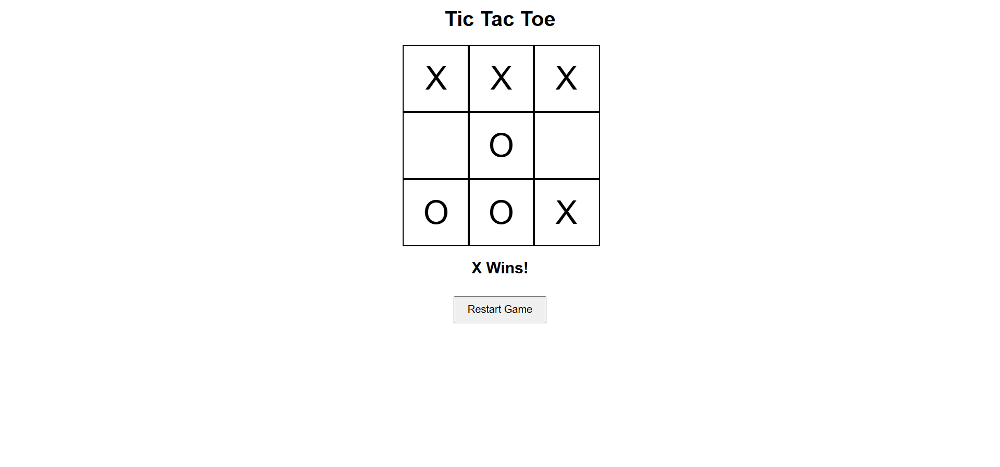

# 🎮 Tic Tac Toe Game

A simple Tic Tac Toe game built using HTML, CSS, and JavaScript.

## 🚀 Features

- Two Player Game (X vs O)
- Winner Detection
- Draw Detection
- Restart Game Button
- Simple and Clean UI

## 🛠️ Technologies Used

- HTML
- CSS
- JavaScript

## 📂 Project Structure

```
tic-tac-toe/
│
├── index.html
├── style.css
├── script.js
└── README.md
```

## ▶️ How to Run

1. Download the project.
2. Open `index.html` in your browser.
3. Start playing.

## 📸 Screenshot



## 👩‍💻 Author

Harshita Chuphal

GitHub: https://github.com/harshitachuphal

LinkedIn: https://www.linkedin.com/in/harshita-chuphal-3a2453326

LeetCode: https://leetcode.com/u/harshitachuphal_12/
